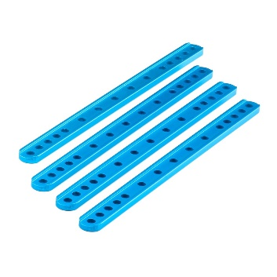
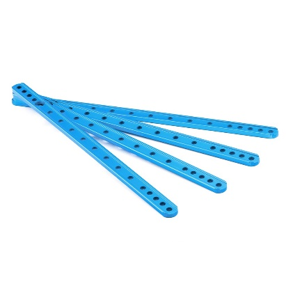

# Beam 0412

**Description**

Makeblock Beam0412 is one of the most frequently used part in Makeblock platform. It is compatible with most Makeblock motion and structure components.

**Specifications**

* Length: 36 - 504mm
* Size \(mm\): 036, 044, 060, 076, 092, 108, 124, 140, 156, 172, 188, 204, 220, 220-L5, 236
* Cross-section area: 4 x 12mm
* Material: 6061 aluminum extrusion

**Features**

* Excellent strength
* Twist resistance
* Easy and flexible connection

**Instructions**

**Demo**

**Size Chart**

<table>
  <thead>
    <tr>
      <th style="text-align:left">
        

          
        

        
Beam0412-036

      </th>
      <th style="text-align:left">
        

          
        

        
Beam0412-044

      </th>
      <th style="text-align:left">
        

          
        

        
Beam0412-060

      </th>
      <th style="text-align:left">
        

          
        

        
Beam0412-076

      </th>
    </tr>
  </thead>
  <tbody>
    <tr>
      <td style="text-align:left">
        

          
        

        
Beam0412-092

      </td>
      <td style="text-align:left">
        

          
        

        
Beam0412-108

      </td>
      <td style="text-align:left">
        

          
        

        
Beam0412-124

      </td>
      <td style="text-align:left">
        

          
        

        
Beam0412-140

      </td>
    </tr>
    <tr>
      <td style="text-align:left">
        

          
        

        
Beam0412-156

      </td>
      <td style="text-align:left">
        

          
        

        
Beam0412-172

      </td>
      <td style="text-align:left">
        

          
        

        
Beam0412-188

      </td>
      <td style="text-align:left">
        

          
        

        
Beam0412-204

      </td>
    </tr>
    <tr>
      <td style="text-align:left">
        

          
        

        
Beam0412-220

      </td>
      <td style="text-align:left">
        

          
        

        
Beam0412-220-L5

      </td>
      <td style="text-align:left">
        

          
        

        
Beam0412-236

      </td>
      <td style="text-align:left"></td>
    </tr>
  </tbody>
</table>