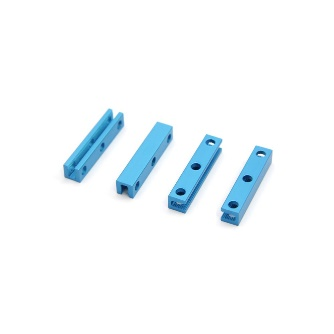
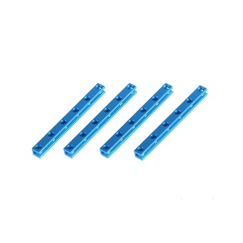
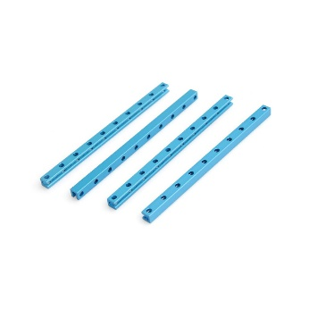
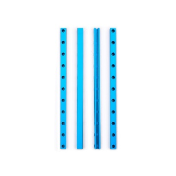
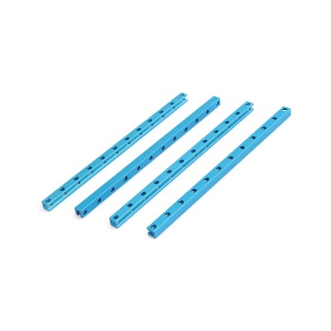
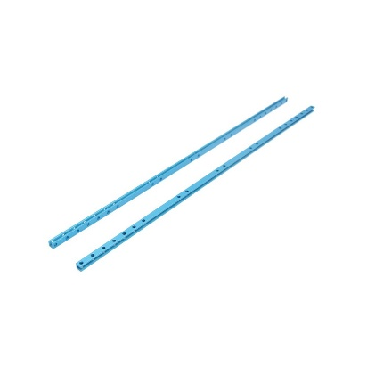

# Beam 0808

**Description**

Makeblock Beam0808 is one of the most frequently used part in Makeblock platform. It is compatible with most Makeblock motion and structure components.

**Specifications**

* Length: 24- 504mm
* Size \(mm\): 024, 040-A, 040-B, 056, 072, 088, 104, 120, 136, 152, 168, 184, 312, 504
* Cross-section area: 8 x 8mm
* Material: 6061 aluminum extrusion

**Features**

* Excellent strength
* Twist resistance
* Easy and flexible connection

**Instructions**

**Demo**

**Size Chart**

<table>
  <thead>
    <tr>
      <th style="text-align:left">
        

          
        

        
Beam0808-024

      </th>
      <th style="text-align:left">
        

          
        

        
Beam0808-040-A

      </th>
      <th style="text-align:left">
        

          
        

        
Beam0808-040-B

      </th>
      <th style="text-align:left">
        

          
        

        
Beam0808-056

      </th>
    </tr>
  </thead>
  <tbody>
    <tr>
      <td style="text-align:left">
        

          
        

        
Beam0808-072

      </td>
      <td style="text-align:left">
        

          
        

        
Beam0808-088

      </td>
      <td style="text-align:left">
        

          
        

        
Beam0808-104

      </td>
      <td style="text-align:left">
        

          
        

        
Beam0808-120

      </td>
    </tr>
    <tr>
      <td style="text-align:left">
        

          
        

        
Beam0808-136

      </td>
      <td style="text-align:left">
        

          
        

        
Beam0808-152

      </td>
      <td style="text-align:left">
        

          
        

        
Beam0808-168

      </td>
      <td style="text-align:left">
        

          
        

        
Beam0808-184

      </td>
    </tr>
    <tr>
      <td style="text-align:left">
        

          
        

        
Beam0808-312

      </td>
      <td style="text-align:left">
        

          
        

        
Beam0808-504

      </td>
      <td style="text-align:left"></td>
      <td style="text-align:left"></td>
    </tr>
  </tbody>
</table>