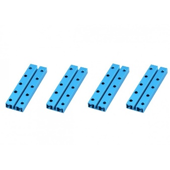
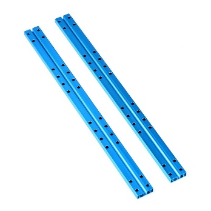
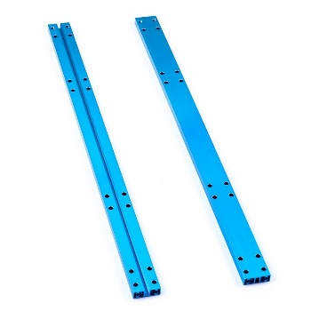

# Beam 0824

**Description**

Makeblock Beam0824 is one of the most frequently used part in Makeblock platform. It is compatible with most Makeblock motion and structure components.

**Specifications**

* Length: 16 - 504mm
* Size \(mm\): 016, 032, 048, 064, 080, 096, 112, 128, 144, 160, 176, 192, 224, 256, 320, 336, 400, 496, 504
* Cross-section area: 8 x 24mm
* Material: 6061 aluminum extrusion

**Features**

* Excellent strength
* Twist resistance
* Easy and flexible connection

**Instructions**

**Demo**

**Size Chart**

<table>
  <thead>
    <tr>
      <th style="text-align:left">
        

          
        

        
Beam0824-016-Blue

      </th>
      <th style="text-align:left">
        

          
        

        
Beam0824-032

      </th>
      <th style="text-align:left">
        

          
        

        
Beam0824-048

      </th>
      <th style="text-align:left">
        

          
        

        
Beam0824-064

      </th>
    </tr>
  </thead>
  <tbody>
    <tr>
      <td style="text-align:left">
        

          
        

        
Beam0824-080

      </td>
      <td style="text-align:left">
        

          
        

        
Beam0824-096

      </td>
      <td style="text-align:left">
        

          
        

        
Beam0824-112

      </td>
      <td style="text-align:left">
        

          
        

        
Beam0824-128

      </td>
    </tr>
    <tr>
      <td style="text-align:left">
        

          
        

        
Beam0824-144

      </td>
      <td style="text-align:left">
        

          
        

        
Beam0824-160

      </td>
      <td style="text-align:left">
        

          
        

        
Beam0824-176

      </td>
      <td style="text-align:left">
        

          
        

        
Beam0824-192

      </td>
    </tr>
    <tr>
      <td style="text-align:left">
        

          
        

        
Beam0824-224

      </td>
      <td style="text-align:left">
        

          
        

        
Beam0824-256

      </td>
      <td style="text-align:left">
        

          
        

        
Beam0824-320

      </td>
      <td style="text-align:left">
        

          
        

        
Beam0824-336

      </td>
    </tr>
    <tr>
      <td style="text-align:left">
        

          
        

        
Beam0824-400

      </td>
      <td style="text-align:left">
        

          
        

        
Beam0824-496

      </td>
      <td style="text-align:left">
        

          
        

        
Beam0824-504

      </td>
      <td style="text-align:left"></td>
    </tr>
  </tbody>
</table>