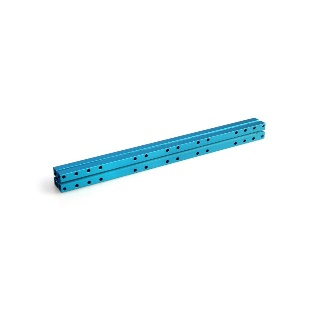

# Beam 2424

**Description**

Makeblock Beam2424 is one of the most frequently used part in Makeblock platform. It is compatible with most Makeblock motion and structure components.

**Specifications**

* Length: 74 - 504mm
* Size \(mm\): 072, 088, 104, 120, 136, 152, 168, 184, 248, 312, 504
* Cross-section area: 24 x 24mm
* Material: 6061 aluminum extrusion

**Features**

* Excellent strength
* Twist resistance
* Easy and flexible connection

**Instructions**

**Size Chart**

<table>
  <thead>
    <tr>
      <th style="text-align:left">
        

          
        

        
Beam2424-072

      </th>
      <th style="text-align:left">
        

          
        

        
Beam2424-088

      </th>
      <th style="text-align:left">
        

          
        

        
Beam2424-104

      </th>
      <th style="text-align:left">
        

          
        

        
Beam2424-120

      </th>
    </tr>
  </thead>
  <tbody>
    <tr>
      <td style="text-align:left">
        

          
        

        
Beam2424-136

      </td>
      <td style="text-align:left">
        

          
        

        
Beam2424-152

      </td>
      <td style="text-align:left">
        

          
        

        
Beam2424-168

      </td>
      <td style="text-align:left">
        

          
        

        
Beam2424-184

      </td>
    </tr>
    <tr>
      <td style="text-align:left">
        

          
        

        
Beam2424-248

      </td>
      <td style="text-align:left">
        

          
        

        
Beam2424-312

      </td>
      <td style="text-align:left">
        

          
        

        
Beam2424-504

      </td>
      <td style="text-align:left"></td>
    </tr>
  </tbody>
</table>