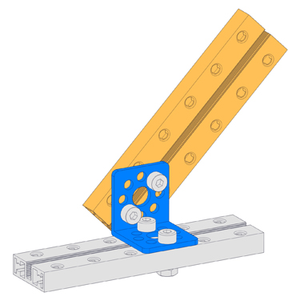

# Bracket L1

**Description**

Bracket L1 is an important fastener to reinforce right angle corner joints.

**Features**

* Specially designed with 90 degrees angle
* two 8mm diameter center holes and 16 M4 mounting holes
* Aluminum extrusion \(high strength\), 2mm thick, anodized surface\(long time to put without barely rusting\)

**Size Charts\(mm\)**

**Demo**

