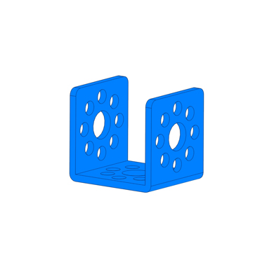

# Bracket U1

**Description**

Bracket U1 is usually used as structural support or connection points for servos, motors, and shafts .

**Features**

* With three 8mm center holes that can be attached with 8mm shaft or bearings
* 24 4mm holes which is compatible with most Makeblock components
* Aluminum extrusion\(high strength\) , 3mm thick, anodized surface\(long time to shelve with barely rusting\)

**Size Charts\(mm\)**

**Demo**

