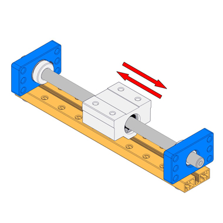

# Roller Motion Block Bracket

**8mm Bearing Bracket A**

**Description**

8mm bearing bracket A has a ball bearing for 8mm shafts, it is usually used as the bracket of 8mm shafts to support heavy mechanisms. With some M4 tapped holes and though holes, you can easily attach it to Makeblock mechanical parts. Bearing 8\*16\*5 is included.

**Size Charts\(mm\)**

**Demo**

