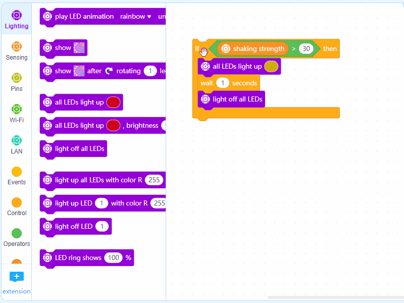

# Plate I1

**Description**

Plate I1 is usually used to build line motion mechanism,rocker mechanisms because it is specially designed with a long slot .

**Features**

* A long slot \( width:4mm, length:60mm \)
* 18 M4 mounting holes compatible with most Makeblock componets.
* Aluminum extrusion \(high strength\),8msick, anodized surface\(long time to shelve with barely rusting\)

**Size Charts\(mm\)**

**Demo**

