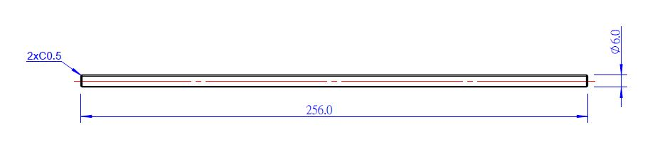

# T6 L256mm Lead Screw and Brass Flange Nut Set

**Description:**

Makeblock T6 L256mm Lead Screw and Brass Flange Nut Set can be self-locking, it is suitable for high torque requirements of transmission, such as the aixs for 3D printer. The lead screw also can carry larger load than the threaded rod.

**Features**

* The lead screw is made of the stainless steel, and the flange nut is made of brass
* Lead screw diameter: 6mm, pitch: 2mm, length:256mm
* Lead screw diameter: 6mm, pitch: 2mm, length:13mm
* The set can be self-locking

**Size Charts\(mm\)**

**Size of the lead screw**

**Size of brass flange nut**

**Demo**

