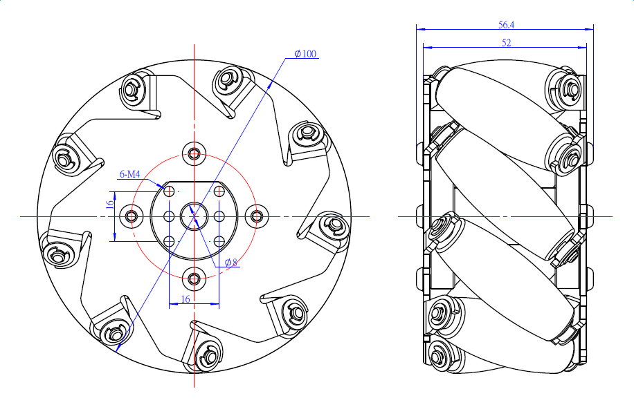

# Mecanum Wheel

**Description**

The 100mm Aluminum Mecanum Wheel Set \(2 x Left, 2 x Right\) includes 2 right wheels and 2 left wheels. Each wheel is composed of 9 rollers and can be driven independently. Mecanum wheels allow your robot to not only travel forward and backward, but also side to side. With 4 mecanum wheels, you can build a car/robot that can move in all direction. Each wheel of this pack comes with a compatible mounting hub - 4mm shaft connector, hence it will mate with our encoder motor or stepper motor easily.

**Features**

* Mecanum wheels allow a robot to achieve omni-directional movement while supporting large weights;
* Complete set of mecanum wheels with 4mm shaft connector;
* Work with encoder motor or stepper motor
* Compatible with 4mm and 8mm motor shaft
* Cold rolled SPCC steel made, strong rigidity and high impact resistance;
* Easy to assemble.

**Specifications**

* SKU: 95067
* Product Name: 100mm Mecanum Wheel Set with 4mm Shaft Connector \(SPCC\)
* Gross Weight: 2150g \(75.84oz\)
* Diameter: 4 inches \(100mm\)
* Width: 52mm
* Rollers: 9 x Rubber Roller
* Plates: 2 x SPCC Plate
* Load Capacity: 30KG
* Package Content \(Quantity x Part Name\):
  * 2 x Right Mecanum Wheel
  * 2 x Left Mecanum Wheel
  * 4 x 4mm shaft connector
  * 8 x Screw M4 x 14mm
  * 8 x Headless Set Screw M3 x 5mm

**Demo:**

**Size Chart:**

