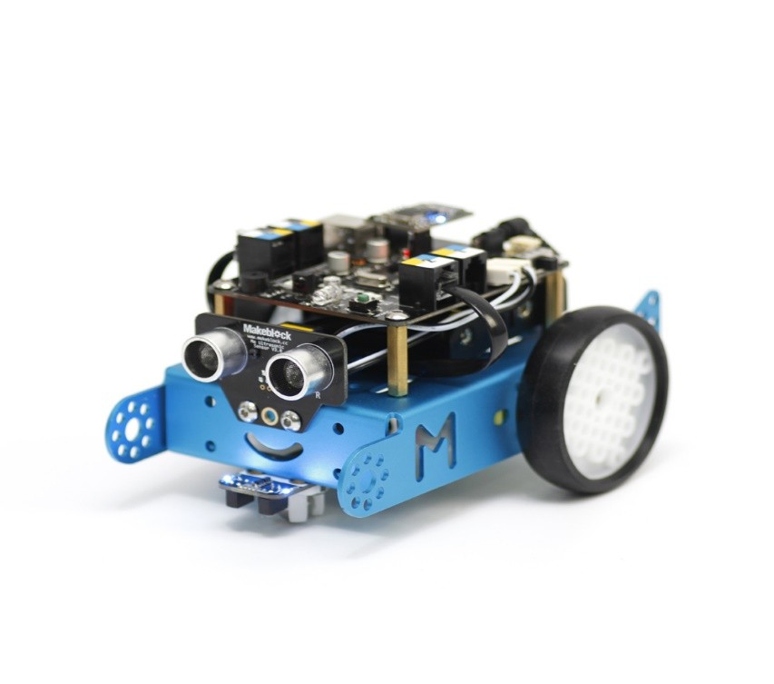

# Tire

**Description**

Makeblock Slick Tyre 64\*16mm is made of silicon and has the smooth surface, it can reduce the resistance, make your remote control car run faster. It is also compatible to Makeblock timing pulley 90T in mBot.

**Features**

* Made of silicon.
* Compatible to timing pulley 90T.
* Sold in pack of 4.

**Size Charts\(mm\)**

**Demo**

