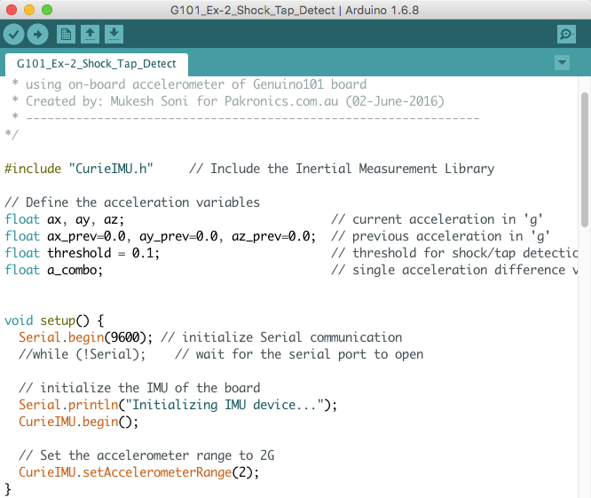

# Shock Tap Detection

### Learning Objectives:

_After performing this lab exercise, you will be able to:_

* Create Arduino sketch \(code\) and program Arduino/Genuino 101 board
* Understand the working of Accelerometers
* Read the acceleration experienced by the Arduino/Genuino 101 board using on-board on-board accelerometers
* Process the accelerometer signals to detect shock or a tap on the board

### Tools and Components Required:

_To perform this lab experiment, you will need:_

#### [http://www.pakronics.com.au/collections/genuino-arduino-cc/products/genuino-101-pakr-m0012](http://www.pakronics.com.au/collections/genuino-arduino-cc/products/genuino-101-pakr-m0012)

#### [http://www.pakronics.com.au/products/9v-battery-clip-with-5-5mm-2-1mm-plug-ada80](http://www.pakronics.com.au/products/9v-battery-clip-with-5-5mm-2-1mm-plug-ada80)

### Working principle of key components

_Before performing this lab experiment, it is important to learn following concepts:_

* Arduino/Genuino 101 is a low-power consumption and high-performance version of Arduino board with Bluetooth low-energy \(BLE\) and accelerometer on board. It is compatible with Arduino/Genuino Uno in term of form factor and peripheral list. \(For more details, please visit: [https://www.arduino.cc/en/Main/ArduinoBoard101](https://www.arduino.cc/en/Main/ArduinoBoard101)\).
* Arduino/Genuino 101 can be easily programmed using Arduino IDE \(version 1.6.7 and higher\). However, the hardware libraries for Arduino/Genuino 101 board needs to be updated / installed. \(Refer appendix for detailed procedure\).
* An accelerometer measures proper acceleration \(g-force\), which is the acceleration it experiences relative to freefall and is the acceleration felt by people and objects. An accelerometer at rest would experience and measure an acceleration of 9.81m/s2 or simply 1g.
* Arduino/Genuino 101 has on-board inertial measurement unit \(IMU\) – BMI 160, developed by Bosch. BMI 160 IMU consists of a low-power 3-axis accelerometer and a 3-axis gyroscope. \( A Details datasheet is available at : [http://ae-bst.resource.bosch.com/media/\_tech/media/datasheets/BST-BMI160-DS000-07.pdf](http://ae-bst.resource.bosch.com/media/_tech/media/datasheets/BST-BMI160-DS000-07.pdf)\).
* CurieIMU library is used for working with the on-board IMU of Arduino/Genuino 101. Using this library, you can access all the parameters, features and reading of IMU chip.
* Tap or shock would cause sudden change in the acceleration values of the board at rest. This ‘differential-acceleration’ values can be compared against a threshold to detect tap or shock.
* Sensitivity of the shock / tap detection can be controlled by varying the threshold.

### Key commands

_Before programming the Arduino/Genuino 101, it is important to learn following key commands:_

* CurieIMU.begin
  * Initialize the IMU of the board
* CurieIMU.setAccelerometerRange
  * Set the accelerometer range in terms of ‘g’
* CurieIMU.readAccelerometer
  * Read the acceleration values \(Ax, Ay and Az\) from on-board IMU
* digitalWrite
  * Turn on/off a digital pin of the Arduino / Genuino board
* abs
  * Returns the absolute value of the input

### Check Your Understanding

1. IMU stands for:
   1. Input Measurement Unit
   2. Input Microprocessing Unit
   3. Inertial Measurement Unit
   4. Isolation Measurement Unit
2. Arduino / Genuino 101 board IMU features
   1. 3-axis accelerometer
   2. 3-axis gyroscope
   3. both a & b
   4. Neither a nor b
3. An accelerometer of BMI160 chip can measure
   1. Only static acceleration
   2. Only dynamic acceleration
   3. both a & b
   4. Neither a nor b
4. CurieIMU.begin command will
   1. Initialize the IMU
   2. Start reading the acceleration values from IMU
   3. Set the ‘g’ range
   4. Read the gyroscope values
5. What is NOT part of Genuino 101 board?
   1. Accelerometer
   2. Pizzo Buzzer
   3. Bluetooth
   4. Analog pins
6. CurieIMU. setAccelerometerRange command will
   1. Initialize the IMU
   2. Start reading the acceleration values from IMU
   3. Set the ‘g’ range
   4. Read the gyroscope values
7. CurieIMU. readAccelerometer command will
   1. Initialize the IMU
   2. Read the acceleration values from IMU
   3. Set the ‘g’ range
   4. Read the gyroscope values from IMU

### Procedure

#### Hardware Setup

* Connect the Arduino/Genuino 101 board with computer using USB cable.

#### Arduino IDE / Library Setup

* Make sure you have Arduino IDE version 1.6.7 or higher and Intel Genuino 101

  drivers installed on your computer. For installation of Arduino IDE and

  drivers, you can follow instructions from Appendix

  A.

#### Creating Sketch / Program

* Open the sketch \(G101\_Ex-2\_Shock\_Tap\_Detect.ino\) on Arduino IDE.

  

* From Tools menu, select the right board \(i.e., Arduino/Genuino 101\) and COM Port it is connected to.

  

* Compile \(verify\) and run \(upload\) the sketch on Arduino board. In case of any upload error, try pressing the Master Reset Button just at the start of upload process.

  

* Open the “serial monitor” of Arduino IDE. It will be used to display the accelerometer values.

  

* Keep the Arduino/Genuino 101 board on a table. When it is at rest, the LED \(on-board LED at pin 13\) will be off. The differential acceleration values \(difference of acceleration now and its previous value\) shown on serial monitor would be around zero.
* Now gently tap the table or board directly. The LED should glow and you should see the values getting changed to a larger value \(other than zero\) on serial monitor.

  

* Changes to acceleration values due to tap or shock can be best viewed graphically on a plotter. Close the Serial Monitor and open the Serial plotter. You should see the pulses/spikes when the board is tapped.

  

### Additional Exercise

_You can extend your learning by trying following programming exercises:_

1. Modify the existing program in such a way that upon tapping the board, the plotter also shows the LED being turned on along with the ‘shock’ spikes.
2. Combine the current program with Bluetooth and make a ‘shock’ detector where the board, apart from indicating through LED, also indicate on a mobile through Bluetooth app.

